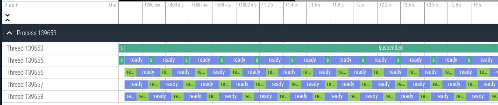

= `gvl-tracing`
:toc:
:toc-placement: macro
:toclevels: 4
:toc-title:

A Ruby gem for getting a timeline view of Global VM Lock usage in your Ruby app that can be analyzed using the https://ui.perfetto.dev/[Perfetto UI].

See my blog post https://ivoanjo.me/blog/2022/07/17/tracing-ruby-global-vm-lock/[tracing ruby's (global) vm lock] for more details!

NOTE: This gem only works on Ruby 3.2 and above because it depends on the new https://github.com/ruby/ruby/pull/5500[GVL Instrumentation API]. See below for an easy way to run Ruby 3.2 inside docker.

== Quickest start

You can play with the output of running the following example:

[source,ruby]
----
require "gvl-tracing"

def fib(n)
  return n if n <= 1
  fib(n - 1) + fib(n - 2)
end

GvlTracing.start("example1.json")

Thread.new { sleep(0.05) while true }

sleep(0.05)

3.times.map { Thread.new { fib(37) } }.map(&:join)

sleep(0.05)

GvlTracing.stop
----

To do so:

1. Download link:https://github.com/ivoanjo/gvl-tracing/blob/master/examples/example1.json.gz?raw=true[`examples/example1.json.gz`]
2. Navigate to https://ui.perfetto.dev/ and use the **Open trace file** option to load the file

== Quick start using docker

The `gvl-tracing` gem requires Ruby 3.2, which is still under development. If you have docker installed on your machine, you can use the https://hub.docker.com/r/rubylang/ruby[ruby-lang development images] to try it out.

Here's how you can use them:

[source,bash]
----
$ cd my_ruby_app/
$ docker run -v $(pwd):/app -it rubylang/ruby:master-focal
root@0e0b07edf906:/# cd app/
root@0e0b07edf906:/app# ruby -v
ruby 3.2.0dev (2022-07-23T12:42:05Z master 721d154e2f) [x86_64-linux]
root@0e0b07edf906:/app# gem install gvl-tracing
Building native extensions. This could take a while...
Successfully installed gvl-tracing-0.1.1
1 gem installed
root@0e0b07edf906:/app# ruby <your app>
----

== Installation

Install the gem and add to the application's `Gemfile` or `gems.rb` file by executing:

[source,bash]
----
$ bundle add gvl-tracing
----

If bundler is not being used to manage dependencies, install the gem by executing:

[source,bash]
----
$ gem install gvl-tracing
----

== Usage

Use `require "gvl-tracing"` to load the gem.

This gem only provides a single module (`GvlTracing`) with methods:

* `start(filename)`: Starts tracing, writing the results to the provided filename
* `stop`: Stops tracing

The resulting traces can be analyzed by going to https://ui.perfetto.dev/[Perfetto UI].

== Tips

You can "embed" links to the perfetto UI which trigger loading of a trace by following the instructions on https://perfetto.dev/docs/visualization/deep-linking-to-perfetto-ui .

This way you can actually link from your dashboards and similar pages directly to a trace.

== Development

To install this gem onto your local machine, run `bundle exec rake install`. To release a new version, update the version number in `version.rb`, and then run `bundle exec rake release`, which will create a git tag for the version, push git commits and the created tag, and push the `.gem` file to https://rubygems.org[rubygems.org].

== Contributing

Bug reports and pull requests are welcome on GitHub at https://github.com/ivoanjo/gvl-tracing. This project is intended to be a safe, welcoming space for collaboration, and contributors are expected to adhere to the https://github.com/ivoanjo/gvl-tracing/blob/master/CODE_OF_CONDUCT.adoc[code of conduct].

== Code of Conduct

Everyone interacting in the gvl-tracing project's codebases, issue trackers, chat rooms and mailing lists is expected to follow the https://github.com/ivoanjo/gvl-tracing/blob/master/CODE_OF_CONDUCT.adoc[code of conduct].
